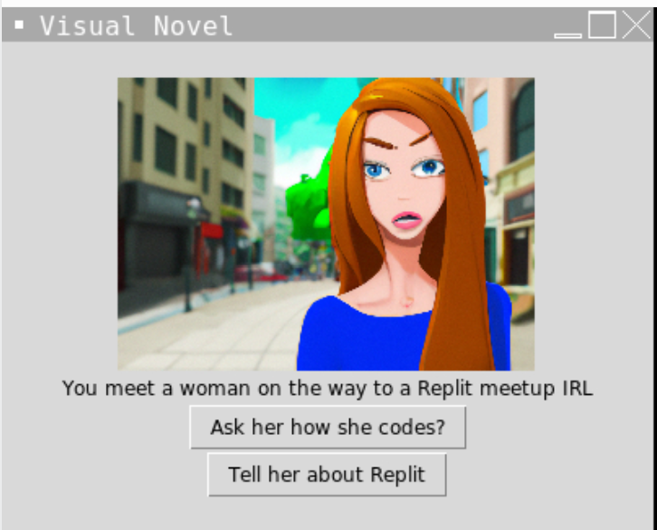
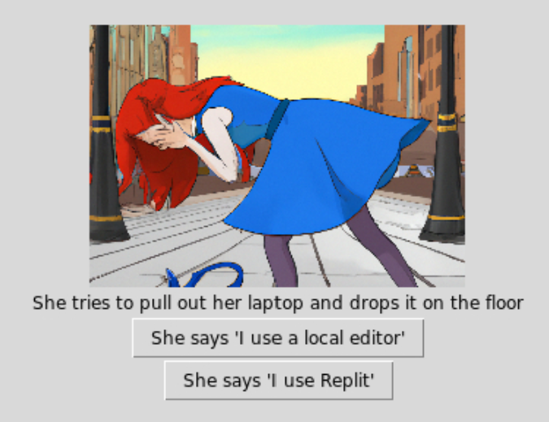
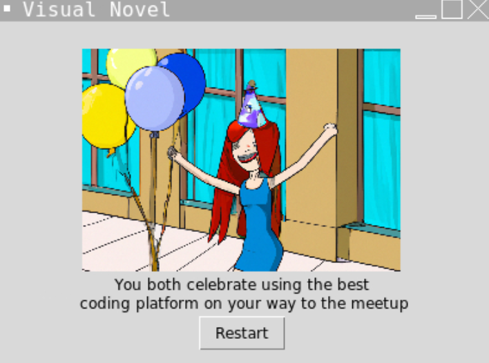

# 👉 Day 69 Challenge

Today's challenge is to create your own visual novel. This is a type of 'choose your own adventure' video game that will show images and a bit of text and let you make decisions that influence what will be displayed next.

Your novel should be quite simple, with only two decisions:

1. Start with a picture, short text introduction and two options.
2. Allow the user to click buttons to choose their option.
3. Display the correct branch, story image & text, and further option buttons based on their choice.
4. From one branch **both** of the second options should lead to the same unhappy ending (not nice, but it'll save you time).
5. The ending should be an image, some text and a 'start again' button that takes you back to page 1.
6. The second branch should have two options, one that leads to a good ending, and one to a bad.  Both of these should also have a 'start again' button.

Example:

 
 💡 Hints 

  
- Nothing big here. Just use subroutines for each of your pages and call them when neccessary.
- Create all of your images and text labels in the main program, but only pack them when they should appear.
- Don't forget to unpack the other page elements that should disappear.

